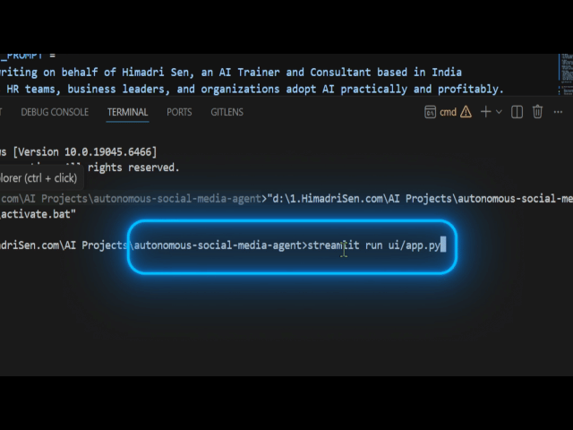
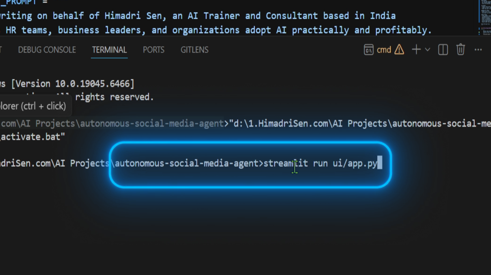
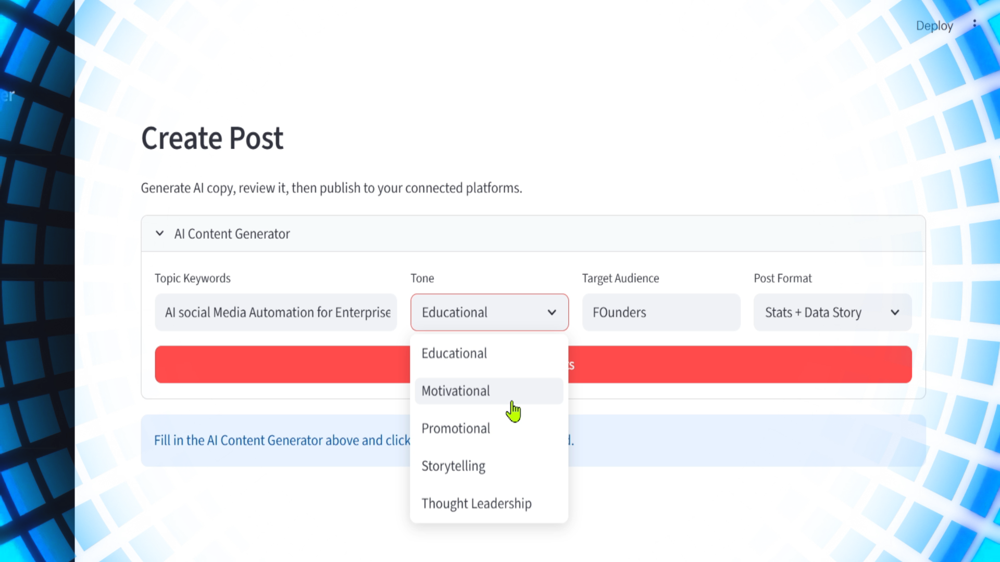
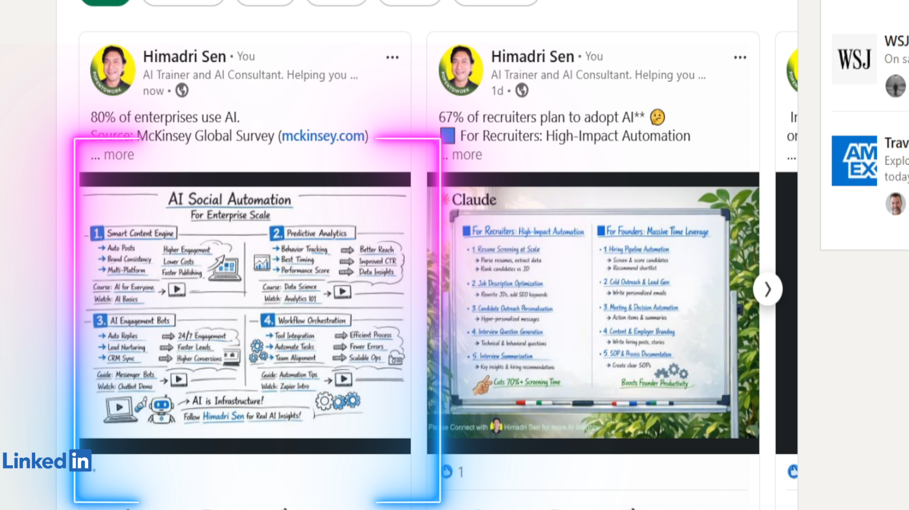

# AI Social Media Manager

> **One input. One click. Post everywhere.**

An open-source autonomous agent that generates platform-optimised social media copy using LLMs and publishes to LinkedIn and Facebook simultaneously — eliminating the manual copy-paste workflow that costs content creators 15–20 minutes per post.


---

## The Problem This Solves

Creating one piece of content today means:

1. Writing a long-form post for LinkedIn/facebook
2. Rewriting a shorter version for X.com/Threads/Bluesky
3. Uploading the same image manually to each platform
4. Adjusting hashtags per platform
5. Repeating this 2–5 times per day

**This tool collapses all of that into a single 2-minute workflow.**

---

## Demo


### Screenshots

**VS Code -- Running the app**


**Streamlit UI -- Generating and composing a post**


**Live post on LinkedIn**


```
Topic:    "AI consulting for HR teams"
Tone:     Educational
Audience: HR managers

→ Generates long-form LinkedIn post  (up to 1000 chars)
→ Generates short-form tweet-style   (up to 150 chars)
→ User reviews and edits inline
→ Attaches one image
→ Posts to LinkedIn + Facebook in one click
```

---

## Features

- **AI Content Generation** — Powered by Groq (Llama 3.3 70B). Generates two post variants from a single topic input with tone and audience control.
- **Live Platform Preview** — Side-by-side preview rendered in native LinkedIn and Facebook card styles before posting.
- **One-Click Multi-Platform Publishing** — Posts text + image to LinkedIn and Facebook simultaneously via official APIs.
- **Editable Output** — All AI-generated text is editable before publishing. Character counter with limit warnings.
- **Post History** — Local JSON log of every published post with platform status.
- **Tone Selector** — Educational, Motivational, Promotional, Storytelling, Thought Leadership.
- **Image / Video Attach** — Upload once, attach to all platforms. Supports JPG, PNG, MP4, MOV (max 200 MB).

---

## Architecture

```
User Input (keywords + tone + audience)
        │
        ▼
┌─────────────────────┐
│   Content Agent     │  ← Groq LLM (Llama 3.3 70B)
│   (agents/)         │     Long post + Short post
└─────────┬───────────┘
          │
    User Review + Edit
          │
    ┌─────┴──────┐
    ▼            ▼
LinkedIn      Facebook
Publisher     Publisher
(OAuth 2.0)  (Graph API)
```

---

## Tech Stack

| Layer | Technology |
|---|---|
| LLM | Groq API — Llama 3.3 70B |
| Agent | Python — direct Groq SDK |
| UI | Streamlit |
| Publishing | LinkedIn UGC API + Meta Graph API |
| Config | python-dotenv |
| Testing | pytest + pytest-mock (18 tests) |
| Runtime | Python 3.11 · Local / localhost |

---

## Project Structure

```
autonomous-social-media-agent/
│
├── agents/
│   └── content_agent.py        # LLM call, returns long + short post
│
├── publishers/
│   ├── linkedin_publisher.py   # LinkedIn UGC API + image upload
│   └── facebook_publisher.py   # Meta Graph API posting
│
├── config/
│   ├── settings.py             # Env var loader + validation
│   └── prompts.py              # All LLM prompt templates
│
├── ui/
│   └── app.py                  # Streamlit 2-page app
│
├── tests/                      # 18 unit tests, zero real API calls
├── data/
│   └── post_history.json       # Local post log
│
├── .env.example                # Template for required credentials
├── requirements.txt
├── SETUP.md                    # Step-by-step credential setup guide
└── README.md
```

---

## Platform Support

| Platform | Status | Version |
|---|---|---|
| LinkedIn Personal Profile | ✅ Supported | v1.0 |
| Facebook Page | ✅ Supported | v1.0 |
| X.com (Twitter) | 🔜 Coming soon | v2.0 |
| Threads (Meta) | 🔜 Coming soon | v2.0 |
| Instagram Business | 🔜 Coming soon | v2.0 |
| Pinterest | 🔜 Planned | v3.0 |
| YouTube Community Posts | 🔜 Planned | v3.0 |
| Google Business Profile | 🔜 Planned | v3.0 |
| LinkedIn Company Page | 🔜 Planned | v3.0 |

---

## Roadmap

| Version | Features |
|---|---|
| **v1.0** ✅ Current | AI generation · LinkedIn + Facebook · image upload · post history |
| **v2.0** | Scheduling · X.com · Threads · Instagram Business |
| **v3.0** | Image generation (Pollinations.ai) · Pinterest · YouTube · analytics dashboard · cloud deployment |

---

## Quick Start

### 1. Clone the repo

```bash
git clone https://github.com/himadri-ai/autonomous-ai-social-media-manager.git
cd autonomous-ai-social-media-manager
```

### 2. Create and activate virtual environment

```bash
# Windows
"C:\Program Files\Python311\python.exe" -m venv venv
venv\Scripts\activate

# Mac / Linux
python3.11 -m venv venv
source venv/bin/activate
```

### 3. Install dependencies

```bash
pip install -r requirements.txt
```

### 4. Configure credentials

```bash
cp .env.example .env
```

Edit `.env` with your API keys. See **[SETUP.md](SETUP.md)** for step-by-step instructions on getting each key.

### 5. Run the app

```bash
streamlit run ui/app.py
```

Open `http://localhost:8501` in your browser.

---

## Running Tests

```bash
pytest tests/ -v
```

Expected output: **18 passed** — all tests run with mocked API calls, no credentials needed.

---

## About

Built by **[Himadri Sen](https://himadrisen.com)** — AI Trainer & Consultant.

This project is part of an open-source portfolio demonstrating practical AI agent implementation for real-world business workflows. If you are looking to build similar AI-powered automation for your team or business, feel free to reach out via [himadrisen.com](https://himadrisen.com).

---

## License

MIT License — free to use, modify, and distribute.